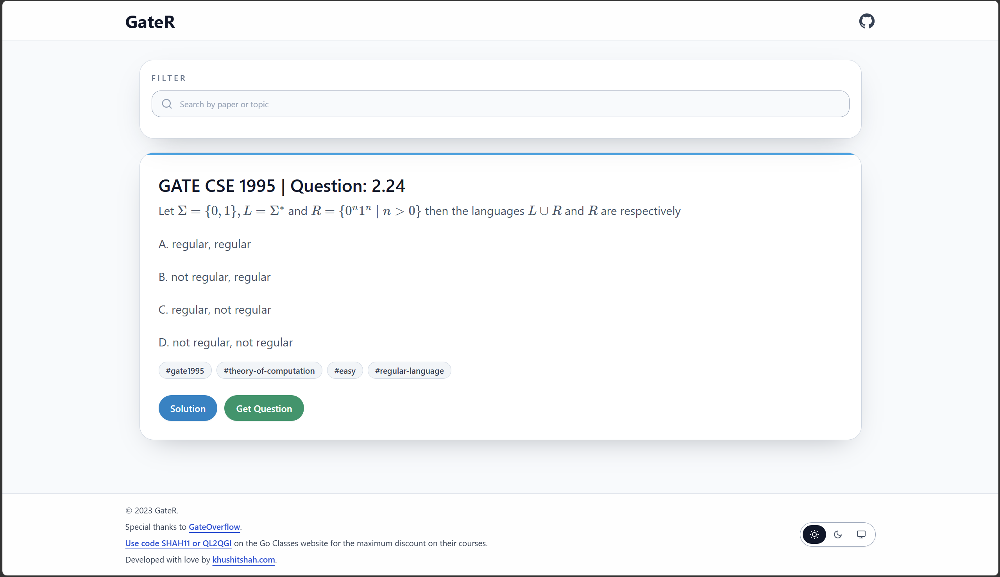
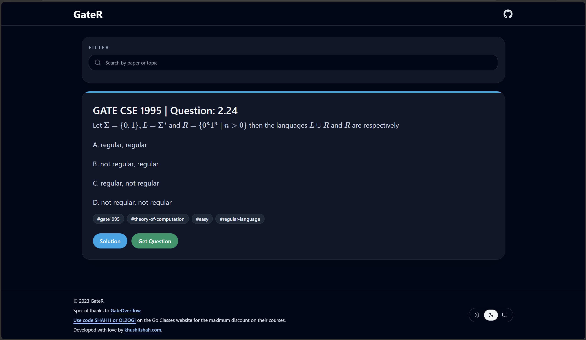
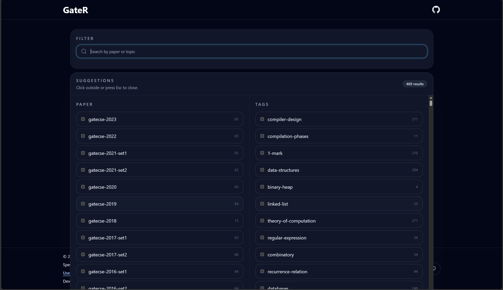
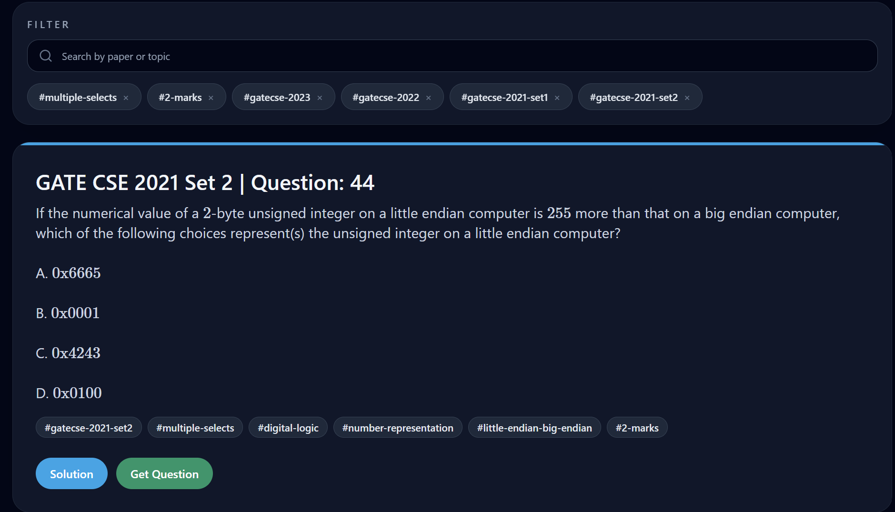
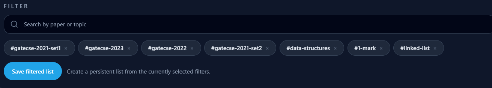
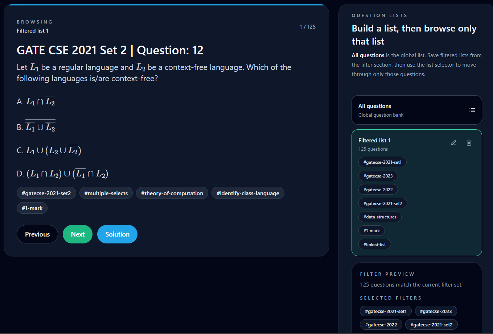

# GateR

GateR is a lightweight GATE CSE question browser built for quick revision. It loads an offline question bank, lets you filter by year or topic, saves filtered questions as reusable lists, renders equations with MathJax, and lets you browse either the full bank or a saved list.

## Screenshots

The app is best represented by these screens:

### Light mode



### Dark mode



### Many filters



### Apply multiple filters



### Create list from filters



### Browse saved list



## What it does

- Browse the full question bank or a saved list without searching through PDFs.
- Filter questions by paper year and topic tag.
- Save a filtered set as a persistent question list.
- Switch between the global question bank and saved lists.
- Edit or delete saved lists as your study plan changes.
- Render mathematical notation and formulas cleanly with MathJax.
- Open the original solution on GateOverflow.
- Switch between light, dark, and system theme preferences.
- Cache the question dataset in localStorage for faster repeat visits.

## Tech Stack

- React 18
- CRA / `react-scripts`
- Tailwind CSS
- `better-react-mathjax`
- `react-icons`

## Project Structure

```text
src/
  App.js                Main application shell and state management
  Header/               Top bar and GitHub link
  FilterTags/           Searchable tag selector
  Question/             Question card and action buttons
  QuestionLists/        Saved list browser and list editor modal
  Footer/               Theme toggle and footer links
  QuestionService.js    Question loading, filtering, list persistence, and browsing state
public/
  questions-filtered.json  Offline question dataset
```

## Getting Started

### Prerequisites

- Node.js 18 or newer
- npm

### Install

```bash
npm install
```

### Run locally

```bash
npm start
```

### Build for production

```bash
npm run build
```

## Available Scripts

- `npm start` - run the development server
- `npm run build` - build the app for production
- `npm test` - run the test runner
- `npm run eject` - eject from CRA

## How It Works

1. The app loads the question dataset from `questions-filtered.json`.
2. Questions are cached in `localStorage` after the first load.
3. The filter panel narrows the question pool by year and topic.
4. You can save the current filtered set as a persistent list.
5. The list panel lets you switch between `All questions` and any saved list.
6. The question card renders HTML and equations with MathJax.
7. The navigation buttons move through the active list in order.
8. The solution button opens the corresponding GateOverflow page when available.

## Deployment

The repository is configured for GitHub Pages deployment.
The published site is expected to live at:

```text
https://khushitshah.com/gater-frontend/
```

## Data Source

The question content is sourced from GateOverflow and stored locally in the repo for offline browsing. All solution links point back to GateOverflow.

## Notes

- The app is designed for quick revision, not exhaustive search.
- If you add more question data, update the JSON dataset and let the service cache refresh.
- Saved lists are stored in `localStorage`, so they persist in the browser where they were created.
- The new list flow starts by applying filters, then saving them as a named list, and finally browsing that list from the sidebar.
- Some questions include external solution links; others are displayed directly from the dataset.

## Contributing

If you want to improve the UI, add more questions, or fix a bug:

1. Fork the repo.
2. Make the change.
3. Test the build.
4. Open a pull request.

## License

No explicit license is currently set in the repository.

## Maintenance

This repository is actively maintained, but it was built partially in a vibe-coded workflow.
